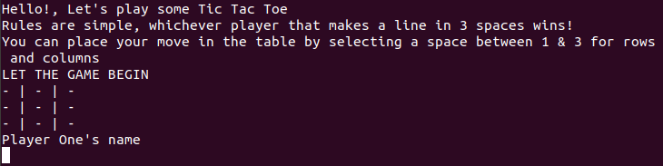

# TicTacToe

In this project we:

- first: Setup the Project
  
    - Created two folders. lib to contain the logic file and Bin for the main file.

- Second: User Interface

    - Organized all the steps that were needed to build the Tic Tac Toe game.

- Third: Game Logic

    - Separated the logic and the displayable for the user. (The first in Lib and the second in Bin)
    - Structured the logic of the game in Classes and Modules in the Lib folder.
    - Compiled all together in the main file

- Fourth: Game Instructions

    - Added the instructions of the game for the Users

    

# What is Tic Tac Toe

Tic Tac Toe it's a game where two players place "x"s or "o"s in a grid with nine spaces. The winner is the first player who places three "x"s or three "o"s in a straight line.

# Game Rules

1. The game is played on a grid with nine spaces.

2. Enter the name of the players (if no name entered it will ask you to enter again)

2. Player 1 is "x", Player 2 is "o". 

3. You can place your move in the table by selecting a space between 1 & 3 for rows and columns (if it's different you will be asked to place it again)

4. If the place its already taken, it will ask you to select a new space

4. The first player to get 3 of "x" or "o" in a row (up, down, across, or diagonally) is the winner of the round.

5. If no player has three marks, the game ends in "Draw!" 

5. When all nine squares are full or there is a winner, the game is over, and you will be asked if you "Want to play another round?"

## Built with

Ruby

## Live Demo

[Click for live webpage](https://repl.it/@RicardoMonteneg/Tic-Tac-Toe#main.rb)

## Getting Started

- Clone the repository

- For Windows Users:
    - In the folder that contains the cloned repository, hold down SHIFT, and right-click.
    - In the context menu click in the option Open command window here (this will open the CDM Window)
    - In the CMD Window run bin/main.rb
    - Enjoy the game

- For Linux Users (Ubuntu):
    - In the folder that contains the cloned repository, right-click.
    - In the context menu click in the option Open in Terminal (this will open the Terminal)
    - In the Terminal run bin/main.rb
    - Enjoy the game

## Author 1

- Github: [@ginnandjuice](https://github.com/ginnandjuice)
- Twitter: [ @fatbaxxter](https://twitter.com/FatBaxxter)
- Linkedin: [Gabriel Suárez](https://www.linkedin.com/in/gabriel-su%C3%A1rez-torres-85125a1ab/)

## Author 2

- Github: [@ricardomonte](https://github.com/ricardomonte)
- Twitter: [@ramnkco](https://twitter.com/ramnkco)
- LinkedIn: [Ricardo Montenegro](https://www.linkedin.com/in/ricardo-antonio-montenegro-nu%C3%B1ez-87a74944/)

## 🤝 Contributing

Contributions, issues and feature requests are welcome! Start by:

- Forking the project
- Cloning the project to your local machine
- `cd` into the project directory
- Run `git checkout -b your-branch-name`
- Make your contributions
- Push your branch up to your forked repository
- Open a Pull Request with a detailed description to the development branch of the original project for a review

## Show your support

Give a ⭐️ if you like this project!
